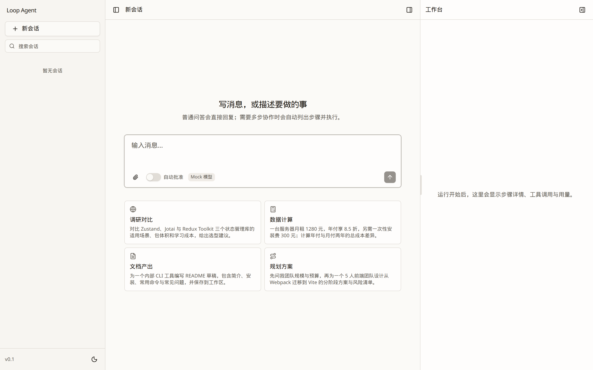
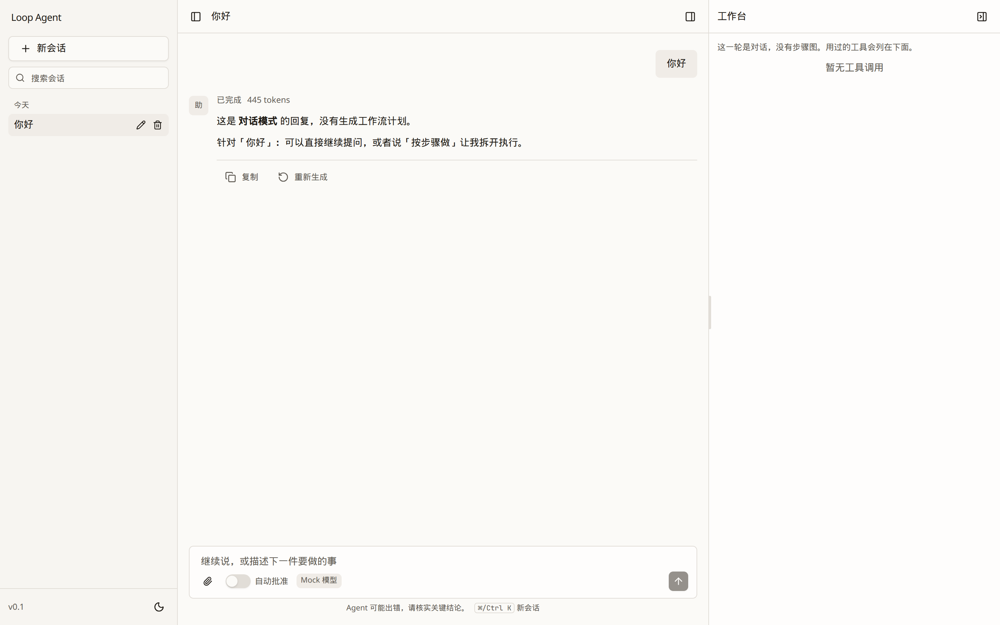
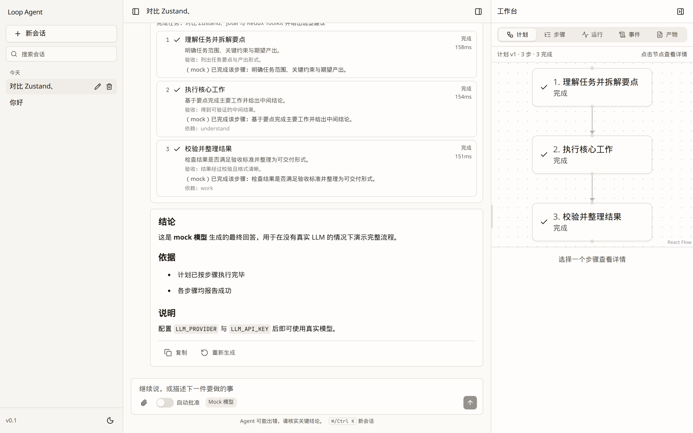
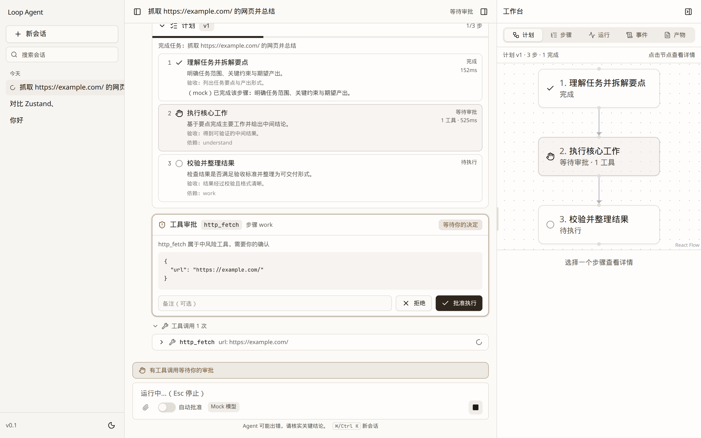
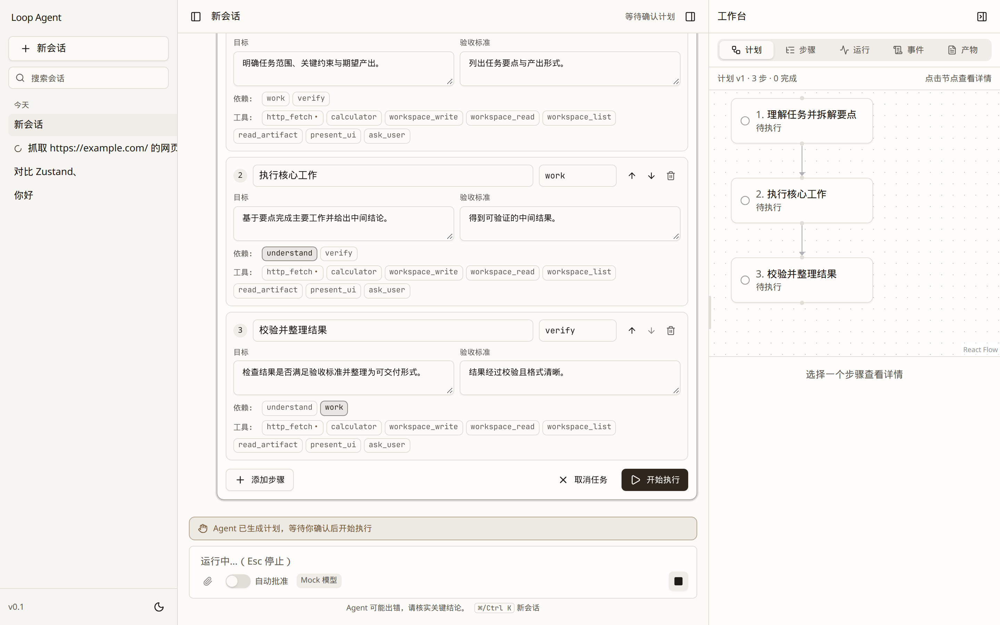
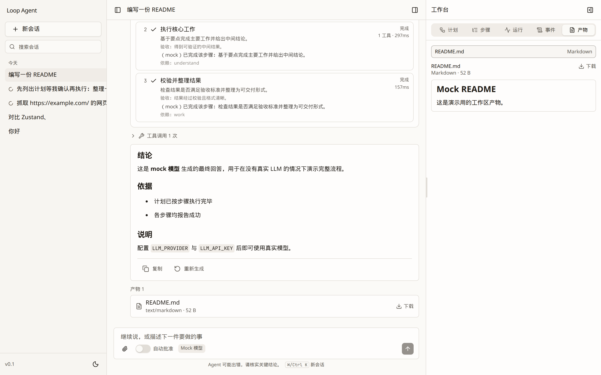
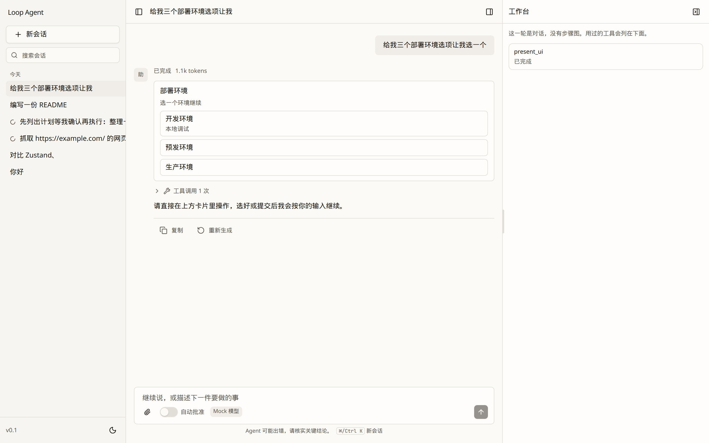

# loop-agent-demo

基础版 loop-agent：Web 页面 + 服务端 Agent Runtime，支持 AI **动态 workflow 规划与执行**（TypeScript 全栈）。

用户输入一个多步骤任务，Agent 会先制定计划（DAG），逐步执行（可并行），每步结束后反思并按需**修订计划**，
必要时向用户**审批工具调用 / 提问 / 确认计划**，最终汇总答案。整个过程以事件流实时推送到前端，
页面刷新或断网后可**自动重连并回放**。

- 设计文档：[loop-agent-design.md](./loop-agent-design.md)（架构、契约、ADR、分阶段实施计划）
- 默认使用**脚本化 mock 模型**，无需任何 API Key 即可离线完整体验与运行测试

## 功能一览

| 能力 | 说明 |
| --- | --- |
| 动态规划 | Planner 生成带依赖关系的步骤 DAG；Reflector 在步骤成功/失败后给出补丁式修订（已完成步骤不可变） |
| 并行执行 | 依赖就绪的步骤按 `BUDGET_MAX_PARALLEL` 并发执行 |
| 内置工具 | `web_search`、`http_fetch`、`calculator`、`workspace_read/write/list`、`read_artifact`、`ask_user`、`finish_step` |
| 人在回路 | 高风险工具审批（可开启自动批准）、Agent 向用户提问；需要时自动列出计划供确认 |
| 预算控制 | 最大重规划次数 / 步骤数 / 总耗时 / 总 token；超限自动进入收尾 |
| 实时可视化 | 计划卡片、步骤 DAG（React Flow）、工具调用详情、工作台（计划 / 步骤 / 用量与成本 / 事件） |
| 持久化与恢复 | SQLite 保存会话、消息、运行、计划修订、事件、审批、产物元数据；服务重启后未完成运行标记为失败并保留进度 |
| 断线重连 | `GET /api/runs/:id/stream?fromSeq=` 回放并续流；前端自动重连 |
| AG-UI 适配 | `POST /api/ag-ui` 把内部 `RunEvent` 译成 AG-UI SSE（外部客户端）；本仓库 Web 仍走 UI Message Stream |
| 会话管理 | 模型自动生成标题、按日期分组、搜索、重命名、删除 |
| 可观测性 | Pino 结构化日志、usage 事件、按模型单价表的成本估算、可选 AI SDK 遥测（`OTEL_ENABLED`）、事件调试视图 |
| 交付 | 单进程生产部署（API + 静态前端）、Dockerfile / docker-compose、Playwright E2E |

## 界面预览

截图在 [`docs/screenshots/`](./docs/screenshots/)，用 mock 模型离线拍摄。需要重拍时：

```bash
pnpm screenshots    # 或 node scripts/capture-docs-screenshots.mjs
```

| 首页（无模式入口） | 对话（不生成计划） |
| --- | --- |
|  |  |

| 工作流计划 + DAG | 工具审批 |
| --- | --- |
|  |  |

| 计划确认 | 产物预览 |
| --- | --- |
|  |  |

| 生成式 UI（点选卡片） |
| --- |
|  |

## 架构

```
┌──────────────────────── apps/web (Vite + React 19) ────────────────────────┐
│  Sidebar(会话)  │  Chat(消息 / 计划卡片 / 审批卡 / 问答卡)  │  Workbench(计划DAG/步骤/用量/事件) │
│  TanStack Router + Query · zustand · AI SDK useChat(UI Message Stream)      │
└──────────────────────────────────┬─────────────────────────────────────────┘
                     REST + SSE    │  POST /api/threads/:id/messages   GET /api/runs/:id/stream
                                   │  POST /api/ag-ui（外部 AG-UI 客户端）
┌──────────────────────────────────▼─────────────────────────────────────────┐
│ apps/server (Hono, Node 22)                                                │
│  routes ─▶ RunManager ─▶ LoopEngine                                        │
│                          ├─ Planner   (chat JSON → Plan DAG)               │
│                          ├─ Executor  (generateText + tools, 每步一个循环)   │
│                          ├─ Reflector (成功/失败后决定 继续 / 修订计划 / 收尾) │
│                          └─ Finalizer (汇总最终回答)                        │
│  EventBus ──▶ 事件即真相：UI 流投影(ui-stream) · 快照投影(projections) · 持久化 │
│  Tools: registry + approval 中间件 · Stores: memory | sqlite (node:sqlite + Drizzle) │
└────────────────────────────────────────────────────────────────────────────┘
packages/shared：前后端共享的 Zod 契约（Plan / Step / Run / Event / UI data parts / 请求体）
```

核心循环（`apps/server/src/runtime/engine/loop-engine.ts`）：

```
plan ─▶ [plan_first? 等待确认] ─▶ 选取就绪步骤(并行) ─▶ 执行 ─▶ 反思
  ▲                                                        │
  └──────────── 修订计划(patch, revision+1) ◀───────────────┤
                                                           ▼
                                        全部完成 / 预算耗尽 / 取消 ─▶ finalize
```

## 快速开始

要求：Node ≥ 22、pnpm 10（`corepack enable` 即可）。

```bash
pnpm install
cp .env.example .env        # 默认 LLM_PROVIDER=mock，无需 API Key
pnpm dev                    # API: http://127.0.0.1:3001   Web: http://localhost:5173
```

服务端会从当前目录向上查找 `.env` 并加载（已有环境变量优先），不再依赖 Node 22.9+ 的 `--env-file-if-exists`。
`pnpm dev` 会用 `node` 直接拉起 `apps/server` 的 tsx 与 `apps/web` 的 Vite（cwd 为对应包目录），并等 `127.0.0.1:3001/health` 就绪后再开前端，避免页面先出现 502。不要在根脚本里再套一层 `pnpm --filter`：Windows 上嵌套 pnpm 会把后端进程挂死（`cd apps/server && pnpm dev` 本身是正常的）。

API 固定绑 IPv4 回环；前端仍监听默认的 `localhost`（Linux 上常为 IPv6）。若页面 502：看终端 `[dev]` / server 日志。健康检查请用 `http://127.0.0.1:3001/health`（不要只测可能走 IPv6 的 `localhost:3001`）。`/health` 的 `store` 字段为 `sqlite`（已落盘）或 `memory`（打开文件失败时的回退，重启丢失）。

打开 http://localhost:5173，输入任务（例如“帮我整理一份 TypeScript 学习路线”）即可看到完整的
规划 → 执行 → 反思 → 收尾过程。想看得更慢一些，可设置 `MOCK_DELAY_MS=800`。

试一下 HITL：

- 在消息里写「先列出计划等我确认再执行」：Agent 生成计划后暂停，可编辑步骤再确认。
- 输入包含“抓取 / 网页 / http” 的任务：mock 模型会调用 `http_fetch`，触发审批卡（关闭“自动批准”开关）。
- 输入包含“问我 / 询问”的任务：Agent 会通过 `ask_user` 向你提问。

接入真实模型：

```bash
LLM_PROVIDER=openai            # 或 anthropic / openai-compatible
LLM_API_KEY=sk-...
LLM_MODEL=gpt-4.1
LLM_MODELS=gpt-4.1,gpt-4.1-mini   # 可选：UI 模型选择器中的备选项
SEARCH_PROVIDER=tavily         # 可选：启用 web_search
SEARCH_API_KEY=tvly-...
```

## 配置

所有配置通过环境变量（见 [`.env.example`](./.env.example)），服务端启动时用 Zod 校验。

| 变量 | 默认 | 说明 |
| --- | --- | --- |
| `PORT` | `3001` | API 端口 |
| `HOST` | `127.0.0.1` | API 监听地址（各系统 IPv4 回环；Docker 需设 `0.0.0.0`） |
| `WEB_ORIGIN` | `http://localhost:5173` | 开发态 CORS 允许来源 |
| `LOG_LEVEL` | `info` | Pino 日志级别 |
| `DATABASE_URL` | `file:./data/loop-agent.db` | SQLite **文件**，重启后会话仍在。只有设成 `memory`（或文件打开失败回退）才会重启丢失 |
| `DATA_DIR` | `./data` | 工具产物工作区 |
| `STATIC_DIR` | — | 设置后由 API 进程同源托管构建好的前端（生产模式） |
| `LLM_PROVIDER` | `mock` | `openai` / `openai-compatible` / `anthropic` / `mock` |
| `LLM_BASE_URL` / `LLM_API_KEY` | — | 提供商地址与密钥 |
| `LLM_MODEL` | `gpt-4.1` | 默认模型；`LLM_PLANNER_MODEL` / `LLM_EXECUTOR_MODEL` 可按角色覆盖 |
| `LLM_MODELS` | — | UI 可选模型列表（逗号分隔） |
| `MOCK_DELAY_MS` | `0` | mock 模型每次调用额外延迟，便于演示 |
| `SEARCH_PROVIDER` / `SEARCH_API_KEY` | `none` | `tavily` / `exa` / `brave`；为 `none` 时 `web_search` 不可用 |
| `BUDGET_MAX_REPLANS` | `3` | 最大重规划次数 |
| `BUDGET_MAX_PARALLEL` | `2` | 最大并行步骤数 |
| `BUDGET_MAX_STEPS` | `12` | 单次运行最大步骤数（≤ 30） |
| `BUDGET_MAX_DURATION_MS` | `900000` | 单次运行最长时间 |
| `BUDGET_MAX_TOTAL_TOKENS` | `300000` | 单次运行 token 上限 |
| `REFLECT_ON_SUCCESS` | `false` | 为 `true` 时成功步骤也走 LLM 反思；默认仅失败与不确定摘要调模型 |
| `OTEL_ENABLED` | `false` | 为模型调用开启 AI SDK 遥测（需在进程内注册 OpenTelemetry SDK/exporter） |

## API

| 方法 | 路径 | 说明 |
| --- | --- | --- |
| GET | `/health` | 健康检查 |
| GET | `/api/models` | 可用模型列表 |
| GET | `/api/tools` | 工具清单（名称、描述、风险等级、是否启用） |
| GET | `/api/threads` | 会话列表 |
| POST | `/api/threads` | 新建会话 `{ title? }` |
| GET | `/api/threads/:id` | 会话详情：消息 + 运行摘要 + `activeRunId` |
| PATCH | `/api/threads/:id` | 重命名 `{ title }` |
| DELETE | `/api/threads/:id` | 删除会话（级联删除运行与事件） |
| POST | `/api/threads/:id/messages` | **发送消息并启动 Run**，返回 UI Message Stream（SSE），响应头 `x-run-id` |
| GET | `/api/runs/:id` | Run 快照：run、当前 plan、steps、待处理交互、usage |
| GET | `/api/runs/:id/events?fromSeq=` | 原始事件（调试视图数据源） |
| GET | `/api/runs/:id/artifacts` | 本次运行的产物清单（不含磁盘路径） |
| GET | `/api/runs/:id/artifacts/:artifactId` | 读取产物内容（`?download` 触发下载） |
| GET | `/api/runs/:id/stream?fromSeq=` | **重连**：以 UI Message Stream 回放并续流；已结束且无缓冲时返回 204 |
| POST | `/api/runs/:id/cancel` | 取消运行 |
| POST | `/api/runs/:id/plan/confirm` | `plan_first` 确认，可携带编辑后的 `steps` |
| POST | `/api/runs/:id/approvals/:approvalId` | `{ approved, reason? }` |
| POST | `/api/runs/:id/questions/:questionId` | `{ answer }` |
| POST | `/api/ag-ui` | **AG-UI**：`RunAgentInput` → SSE 事件；HITL 以 `RUN_FINISHED` + `outcome.interrupt` 结束本轮 HTTP，再用 `resume[]` 续跑 |

`POST /api/ag-ui` 请求体（字段对齐 AG-UI，缺省均可）：

```ts
{
  threadId?: string;                     // 客户端会话 id；不存在则按该 id 建会话
  messages: Array<{                      // 取最后一条 user 的文本
    id?: string;
    role: string;
    content?: string | Array<{ type?: string; text?: string }>;
    toolCallId?: string;
  }>;
  forwardedProps?: { model?: string; autoApprove?: boolean; mode?: 'auto' | 'chat' | 'plan_first' };
  resume?: Array<{ interruptId: string; status: 'resolved' | 'cancelled'; payload?: unknown }>;
}
```

`POST /api/threads/:id/messages` 请求体：

```ts
{
  messages: UIMessage[];                 // useChat 默认发送；服务端只取最后一条 user 消息
  mode?: 'auto' | 'plan_first';
  model?: string;
  toolPolicy?: { autoApprove?: boolean };
}
```

流中除标准文本块外，还包含以 `data-` 为前缀的自定义 data parts（`data-run`、`data-plan`、`data-step`、
`data-step-log`、`data-tool`、`data-approval`、`data-question`、`data-usage`、`data-notice`），契约定义见 `packages/shared/src/schema/`。

## 目录结构

```
apps/server/src
  app.ts                  Hono 应用组装：路由、CORS、静态托管、启动恢复
  config.ts               环境变量 Schema
  providers/              模型提供商适配（openai / anthropic / openai-compatible / mock）
  routes/                 threads / runs / meta / ag-ui
  runtime/
    engine/               loop-engine, planner, executor, reflector, finalizer, budget, hitl, approval
    tools/                工具注册表与内置工具
    event-bus.ts          Run 级事件总线（seq 递增）
    projections.ts        事件 → Run 快照
    ui-stream.ts          事件 → UI Message Stream chunk
    run-manager.ts        运行生命周期、缓冲与订阅、HITL 应答
    recovery.ts           启动时处理被中断的运行
    title.ts              会话标题生成
  store/                  Stores 接口 + memory / sqlite 实现（Drizzle schema）
apps/web/src
  routes/                 TanStack Router 页面（首页、会话页）
  features/chat/          消息列表、Composer、计划/步骤/工具/审批/问答卡片、useAgentChat
  features/workbench/     步骤详情、用量、事件时间线
  components/             布局与 UI 基础组件
  stores/                 zustand（运行视图、UI 状态、工作台）
packages/shared/src       Zod 契约与类型
e2e/                      Playwright 端到端测试
```

## 开发脚本

| 命令 | 说明 |
| --- | --- |
| `pnpm dev` | 根目录同时启动 server（tsx watch）与 web（Vite），不嵌套 pnpm |
| `pnpm --filter @loop-agent/server dev` | 只启 API（`cd apps/server && pnpm dev` 效果相同） |
| `pnpm build` | 构建 shared → server（tsup）→ web（Vite） |
| `pnpm test` | 全部 Vitest 单元/集成测试（mock 模型，含 SQLite 存储、HITL、重连） |
| `pnpm typecheck` | 全部包 `tsc --noEmit` |
| `pnpm lint` / `pnpm format` | Biome 检查 / 格式化 |
| `pnpm e2e` | Playwright 端到端测试（首次需 `pnpm exec playwright install chromium`） |

输入框不切换模式：普通问答直接回复，多步任务自动规划执行；可以说「先看计划」再确认。右侧工作台可拖动左缘调宽。

## 生产部署

### 单进程（无 Docker）

```bash
pnpm build
STATIC_DIR=$PWD/apps/web/dist DATABASE_URL=file:./data/loop-agent.db \
  pnpm --filter @loop-agent/server start      # http://localhost:3001 同时提供 API 与前端
```

### Docker

```bash
docker compose up --build            # http://localhost:3001，数据持久化在 loop-agent-data 卷
LLM_PROVIDER=openai LLM_API_KEY=sk-... docker compose up -d   # 使用真实模型
```

镜像为多阶段构建：构建阶段安装 workspace 依赖并 `pnpm build`，运行阶段仅包含 server 的生产依赖、`dist` 与前端静态文件，
以非 root 用户运行，并内置 `/health` 健康检查。

## 测试

- **单元/集成**（`pnpm test`）：shared 契约校验；server 侧 EventBus、工具、LoopEngine（串行/并行/重规划/预算）、
  HITL（审批/提问/计划确认）、SQLite 存储、流式重连；web 侧侧栏分组与运行视图投影。
- **端到端**（`pnpm e2e`）：真实 server（mock 模型 + 内存存储）+ Vite dev server，覆盖
  发起任务并完成 → 运行中刷新页面自动恢复 → 工具审批 → `plan_first` 计划确认。

## 常见问题

**根目录 `pnpm dev` 只有前端、后端一直卡住？** — 旧脚本用 concurrently 再跑 `pnpm --filter @loop-agent/server dev`，Windows 上嵌套 pnpm 会让 tsx 永远进不了 listen。单独 `cd apps/server && pnpm dev` 能起 `3001` 就是这个原因。根目录现在改为 `node scripts/dev.mjs`，用当前 Node 直接执行 tsx / Vite。

**为什么不用 libsql / 为什么 3001 会因为数据库挂掉？** — 设计里选 `@libsql/client` 是为了单机 SQLite + 以后能迁 Turso。它是额外的原生绑定，Windows 上加载失败时旧实现会在 `listen` 之前退出，Vite 就 502。现在改为 Node 22 自带的 `node:sqlite`（随运行时分发，不再 `pnpm rebuild`）；文件打不开时回退内存存储，**HTTP 服务照样启动**。

**`.env` 写了 SQLite，重启数据怎么还没了？** — 默认 `DATABASE_URL=file:./data/loop-agent.db` **会落盘**。注释里 “lost on restart / 重启丢失” 只适用于 `DATABASE_URL=memory`。打开 `http://127.0.0.1:3001/health`：`persist: true` 才是文件库；`store: "memory"` 表示你显式设了 memory，或文件没打开成功（看 `[server]` 的 warn）。

**真实模型报「响应 schema 格式不正确」或 `response did not match schema`** — Planner / Reflector 不再走各协议的原生 structured output（`response_format.json_schema`、Anthropic json tool、OpenAI Responses API）。改为普通 chat 文本出 JSON，服务端用 Zod 校验并自动修一次。`LLM_PROVIDER=openai` 固定走 `/v1/chat/completions`。lite / 内外网关请设 `LLM_BASE_URL` 指向 chat completions，密钥用 `LLM_API_KEY`。

**启动报 `Invalid configuration`** — 某个环境变量不合法（例如 `LLM_PROVIDER` 拼写错误），错误信息会列出具体字段。

**`web_search` 显示不可用** — 需要设置 `SEARCH_PROVIDER` 与 `SEARCH_API_KEY`；mock 模式下该工具由脚本模拟。

**页面刷新后运行还在继续吗？** — 是。运行在服务端进行；前端回到会话时通过 `activeRunId` 重连并回放事件。
如果服务进程重启，未完成的运行会被标记为失败，已完成步骤与事件保留可查。

**如何查看某次运行的原始事件？** — 打开右侧工作台的「事件」标签，或请求 `GET /api/runs/:id/events`。

**审批卡片没有出现** — 检查输入框上方的「自动批准」开关是否处于关闭状态；只有 `risk` 为中/高的工具才需要审批。

**如何调整 Agent 的“谨慎程度”？** — `REFLECT_ON_SUCCESS=false` 可减少模型调用；`BUDGET_*` 系列变量限制重规划次数与规模。
