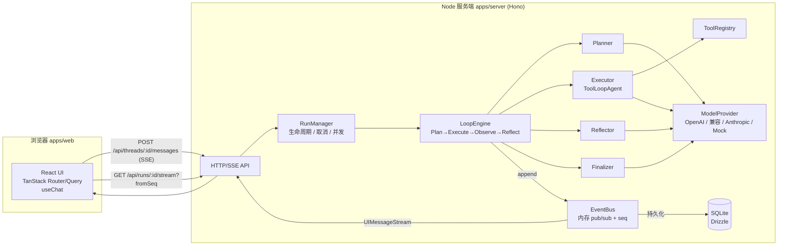
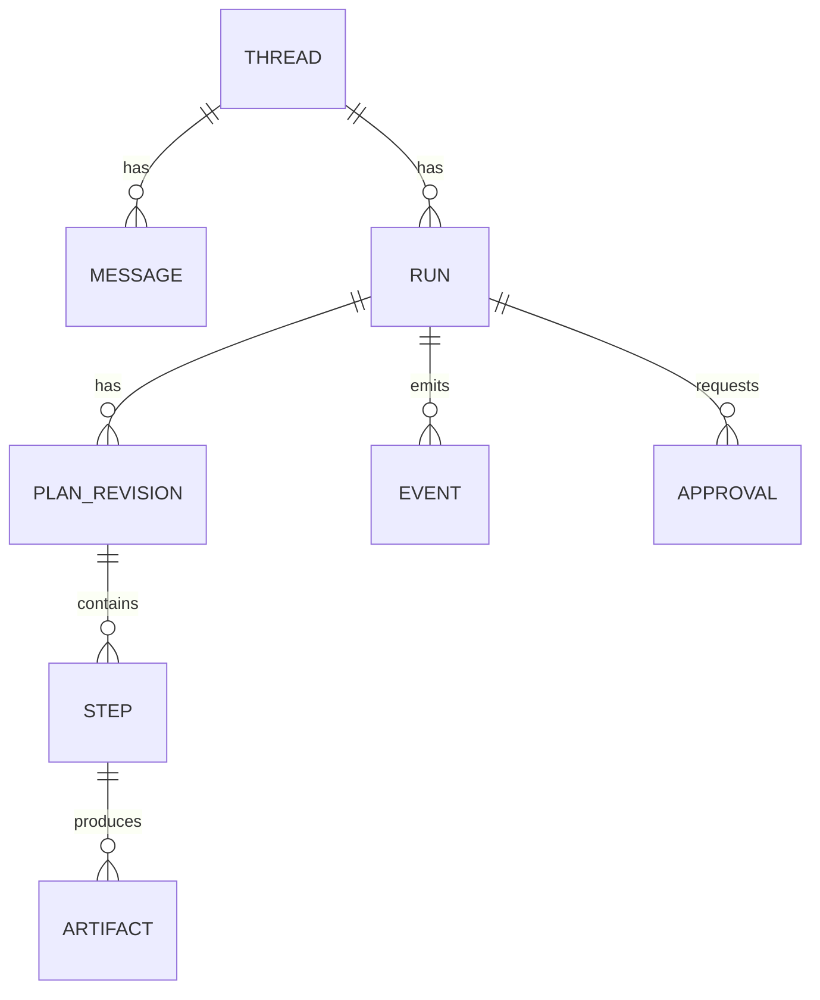
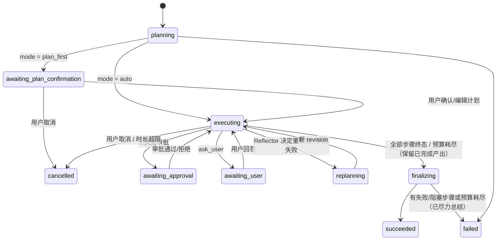

# loop-agent 基础版设计文档

> 版本：v0.1（设计稿）  
> 状态：待评审  
> 范围：Web 前端 + 服务端 Agent Runtime，TypeScript 全栈

---

## 目录

1. [目标与范围](#1-目标与范围)
2. [术语](#2-术语)
3. [总体架构](#3-总体架构)
4. [技术选型](#4-技术选型)
5. [领域模型](#5-领域模型)
6. [服务端 Agent Runtime](#6-服务端-agent-runtime)
7. [动态 Workflow 规划与执行](#7-动态-workflow-规划与执行)
8. [工具系统](#8-工具系统)
9. [API 与流式协议](#9-api-与流式协议)
10. [Web 前端设计](#10-web-前端设计)
11. [持久化、可观测性、安全与配置](#11-持久化可观测性安全与配置)
12. [实施阶段](#12-实施阶段)
13. [关键决策记录（ADR-lite）](#13-关键决策记录adr-lite)
14. [风险与后续演进](#14-风险与后续演进)

---

## 1. 目标与范围

### 1.1 目标

构建一个**基础版 loop-agent**：用户在 Web 页面提出任务，服务端 Agent Runtime 通过「规划 → 执行 → 观察 → 反思/重规划」的循环，**由 AI 动态生成并调整 workflow**（步骤 DAG），逐步调用工具完成任务，并把全过程实时流式呈现在 UI 上。

核心能力：

| 能力 | 说明 |
| --- | --- |
| 动态规划 | 模型根据任务生成结构化 Plan（步骤 DAG），而非固定流程 |
| 循环执行 | 每个步骤由带工具的 Agent 循环执行，产出结构化结果 |
| 动态重规划 | 步骤失败/产出偏离/新信息出现时，模型对未执行步骤做增删改（Plan 版本化） |
| 实时可视 | 计划、步骤状态、工具调用、推理、最终答案全部流式推送到 UI |
| 人在回路 | 高风险工具需审批；可选「先确认计划再执行」；Agent 可向用户提问 |
| 可恢复 | 运行事件持久化，刷新/断线后可重连回放 |

### 1.2 非目标（基础版不做）

- 多租户/权限体系（预留 `userId` 字段即可）
- 分布式/多实例部署（单进程内存 + SQLite；预留接口）
- 复杂沙箱（代码执行仅提供受限计算工具；容器沙箱列入演进）
- 语音、多模态输入（文件附件放在演进）

### 1.3 成功标准

- 用户输入一个多步任务（例如「调研 3 个 TS 状态管理库并给出选型建议表格」），能看到 AI 生成计划、逐步执行、必要时重规划、最终输出 Markdown 答案。
- 刷新页面后历史会话与运行详情可恢复；运行中断线可重连续流。
- 使用 mock 模型可在无 API Key 环境跑通全部自动化测试。

---

## 2. 术语

| 术语 | 定义 |
| --- | --- |
| Thread（会话） | 一组连续的用户/助手消息，对应 UI 的一个聊天窗口 |
| Run（运行） | 用户一次任务触发的一次完整 Agent 循环，属于某个 Thread |
| Plan（计划） | Run 的步骤 DAG，带版本号（revision）；每次重规划产生新 revision |
| Step（步骤） | Plan 中的节点；有目标、依赖、允许工具、验收标准与执行结果 |
| Planner | 生成/修订 Plan 的 LLM 调用 |
| Executor | 执行单个 Step 的 Tool-Loop Agent |
| Reflector | 步骤结束后判断「继续 / 重规划 / 询问用户 / 完成」的 LLM 调用 |
| Finalizer | 汇总各步骤结果生成最终回答的 LLM 调用 |
| Event | Run 内的不可变、有序（seq）事件，是持久化与流式推送的唯一事实来源 |
| Data Part | AI SDK UI Message Stream 中的自定义 `data-*` 分片，用于向 UI 推送结构化状态 |

---

## 3. 总体架构



分层原则：

- **`packages/shared`** 是前后端唯一契约：Zod schema（Plan/Step/Event/Data Part）与派生 TS 类型。
- **服务端 Runtime 与 HTTP 解耦**：`LoopEngine` 只依赖 `EventBus` 与 `ModelProvider` 接口，可被 REST、CLI、测试直接驱动。
- **事件溯源思想（轻量）**：Run 的全部状态变化先写 Event，再投影为 Plan/Step 快照；UI 流与持久化都消费同一事件流。

---

## 4. 技术选型

### 4.1 总览

| 层 | 选型 | 版本（2026-09 核实） | 选择理由 |
| --- | --- | --- | --- |
| 包管理/Monorepo | pnpm workspaces（+ Turborepo 可选） | pnpm 10 | 简单、成熟；`apps/*` + `packages/*` |
| 语言 | TypeScript（strict, ESM） | 5.x | AI SDK 7 已 ESM-only |
| 运行时 | Node.js | 22 LTS | 环境已具备 |
| 服务端框架 | Hono + `@hono/node-server` | 4.x / 2.x | 轻量、原生 Web 标准 `Request/Response`，与 AI SDK 的 `createUIMessageStreamResponse` 天然契合；可无缝迁移到 Bun/Edge |
| AI 编排 | Vercel AI SDK `ai` | 7.0.x | `ToolLoopAgent`（步骤执行循环）、`generateObject`/`Output.object`（结构化规划）、`createUIMessageStream`（自定义 data parts）、`toolApproval`（审批）、`ai/test` mock 模型 |
| 模型提供方 | `@ai-sdk/openai`、`@ai-sdk/openai-compatible`、`@ai-sdk/anthropic` | 4.x / 3.x / 4.x | 通过环境变量切换；`openai-compatible` 覆盖国内外大部分兼容网关 |
| Schema | Zod | 4.x | AI SDK 工具/结构化输出的一等公民 |
| ORM/DB | Drizzle ORM + SQLite（`@libsql/client`） | 0.45 / 0.18 | 零运维、类型安全；后续可切 Turso/Postgres |
| 前端构建 | Vite + React 19 | 8.x / 19.x | 快速、生态成熟 |
| 路由/数据 | TanStack Router（文件路由）+ TanStack Query | 1.x / 5.x | 类型安全路由；Query 管理会话列表、运行详情等非流式数据 |
| 聊天状态 | `@ai-sdk/react` `useChat` + `DefaultChatTransport` | 4.x | 直接消费 UI Message Stream，含工具分片、审批分片、data parts |
| UI 组件 | Tailwind CSS 4 + shadcn/ui + AI Elements | 4.x / – / 1.x | AI Elements 是基于 shadcn 的 AI 聊天组件集（Message、Reasoning、Tool、PromptInput 等），符合主流 Agent 产品形态 |
| Markdown 渲染 | Streamdown | 2.x | Vercel 出品，面向流式 Markdown（未闭合代码块/表格容错） |
| DAG 可视化 | `@xyflow/react`（React Flow） | 12.x | 展示 Plan 步骤 DAG 与状态 |
| 测试 | Vitest | 5.x | 前后端统一；服务端用 `MockLanguageModelV4` |
| 可观测 | Pino 日志 + `@ai-sdk/otel`（可选） | – | 结构化日志；OTel 按需接入 |

### 4.2 为什么不直接用 `@ai-sdk/workflow` 的 `WorkflowAgent`

`WorkflowAgent` 提供持久化、可恢复的 Agent 循环，但依赖 Workflow DevKit 运行时（`'use workflow'`/`'use step'` 编译指令，当前 beta）。基础版目标是**自主可控的动态 workflow 规划**（显式 Plan 对象、可视化、可重规划），而非单一 tool-loop 的持久化。因此：

- 基础版：自研 `LoopEngine` + 事件日志（SQLite）实现「可恢复的展示」与「断线重连」；
- 演进：当需要「进程崩溃后从断点继续执行」时，将 Executor 替换为 `WorkflowAgent`（见 §14）。

### 4.3 为什么不只用一个 `ToolLoopAgent`

单个 tool-loop 是隐式规划（模型边想边调工具）。需求明确要求「AI 动态 workflow 规划和执行」，即计划是**显式、结构化、可视、可修订**的对象。因此采用 **Planner–Executor–Reflector** 分层：Planner 产出结构化 Plan，`ToolLoopAgent` 作为每个 Step 的执行器，Reflector 负责动态修订。

---

## 5. 领域模型

所有 schema 定义在 `packages/shared/src/schema/*.ts`，用 Zod 表达，前后端共用。

### 5.1 核心实体



### 5.2 Plan / Step

```ts
// packages/shared/src/schema/plan.ts
export const StepStatus = z.enum([
  'pending', 'ready', 'running', 'succeeded', 'failed',
  'skipped', 'blocked', 'cancelled', 'waiting_approval', 'waiting_user',
]);

export const StepSchema = z.object({
  id: z.string(),                     // 稳定 ID，重规划时保留已执行步骤
  title: z.string().max(80),
  goal: z.string(),                   // 该步骤要达成什么
  dependsOn: z.array(z.string()),     // 依赖的 step id，形成 DAG
  tools: z.array(z.string()),         // 允许使用的工具名（ToolRegistry 中的子集）
  acceptance: z.string(),             // 验收标准，Executor 与 Reflector 共同使用
  status: StepStatus,
  attempt: z.number().int().default(0),
  result: z.object({
    summary: z.string(),              // 给下游步骤/Finalizer 看的精简摘要
    output: z.unknown().optional(),   // 结构化产出（可选）
    artifacts: z.array(z.string()),   // artifact id 列表
  }).optional(),
  error: z.string().optional(),
  usage: UsageSchema.optional(),
  startedAt: z.string().datetime().optional(),
  endedAt: z.string().datetime().optional(),
});

export const PlanSchema = z.object({
  runId: z.string(),
  revision: z.number().int(),         // 从 1 开始，每次重规划 +1
  objective: z.string(),              // 模型复述的任务目标
  steps: z.array(StepSchema).min(1).max(12),
  rationale: z.string().optional(),   // 本次（重）规划理由，展示给用户
  createdAt: z.string().datetime(),
});
```

Planner 的输出 schema 是 `PlanSchema` 的「生成子集」（不含 status/result 等运行时字段），由服务端补全。

### 5.3 Run

```ts
export const RunStatus = z.enum([
  'queued', 'planning', 'awaiting_plan_confirmation', 'executing',
  'replanning', 'awaiting_approval', 'awaiting_user', 'finalizing',
  'succeeded', 'failed', 'cancelled',
]);

export const RunSchema = z.object({
  id: z.string(),
  threadId: z.string(),
  status: RunStatus,
  input: z.string(),                    // 用户任务文本
  mode: z.enum(['auto', 'plan_first']), // 是否先确认计划
  currentRevision: z.number().int(),
  budget: BudgetSchema,                 // 上限（步数、重规划次数、token、时长）
  usage: UsageSchema,                   // 累计消耗
  finalAnswer: z.string().optional(),
  error: z.string().optional(),
  createdAt, startedAt, endedAt,
});
```

### 5.4 Event（唯一事实来源）

```ts
export const RunEventSchema = z.discriminatedUnion('type', [
  z.object({ type: z.literal('run.status'), status: RunStatus, reason: z.string().optional() }),
  z.object({ type: z.literal('plan.created'), plan: PlanSchema }),
  z.object({ type: z.literal('plan.revised'), plan: PlanSchema, diff: PlanDiffSchema, reason: z.string() }),
  z.object({ type: z.literal('step.status'), stepId: z.string(), status: StepStatus, attempt: z.number() }),
  z.object({ type: z.literal('step.result'), stepId: z.string(), result: StepResultSchema }),
  z.object({ type: z.literal('step.text_delta'), stepId: z.string(), delta: z.string() }),
  z.object({ type: z.literal('step.reasoning_delta'), stepId: z.string(), delta: z.string() }),
  z.object({ type: z.literal('tool.call'), stepId: z.string(), toolCallId: z.string(), toolName: z.string(), input: z.unknown() }),
  z.object({ type: z.literal('tool.result'), stepId: z.string(), toolCallId: z.string(), output: z.unknown(), durationMs: z.number() }),
  z.object({ type: z.literal('approval.requested'), approvalId: z.string(), stepId: z.string(), toolCallId: z.string(), toolName: z.string(), input: z.unknown(), reason: z.string().optional() }),
  z.object({ type: z.literal('approval.resolved'), approvalId: z.string(), approved: z.boolean(), reason: z.string().optional() }),
  z.object({ type: z.literal('user_question.asked'), questionId: z.string(), stepId: z.string(), question: z.string(), options: z.array(z.string()).optional() }),
  z.object({ type: z.literal('user_question.answered'), questionId: z.string(), answer: z.string() }),
  z.object({ type: z.literal('reflection'), stepId: z.string(), decision: ReflectionDecisionSchema }),
  z.object({ type: z.literal('final.text_delta'), delta: z.string() }),
  z.object({ type: z.literal('final.done'), answer: z.string() }),
  z.object({ type: z.literal('usage'), usage: UsageSchema }),
  z.object({ type: z.literal('log'), level: z.enum(['debug','info','warn','error']), message: z.string(), data: z.unknown().optional() }),
  z.object({ type: z.literal('error'), message: z.string(), stepId: z.string().optional(), fatal: z.boolean() }),
]).and(z.object({
  runId: z.string(),
  seq: z.number().int(),        // 单 Run 内单调递增，用于重连
  ts: z.string().datetime(),
}));
```

`*_delta` 类高频事件只入内存流不落库（落库时聚合为最终文本），其余事件全部落库。

---

## 6. 服务端 Agent Runtime

### 6.1 目录结构

```
apps/server/src/
├── index.ts                  # 启动 Hono
├── app.ts                    # 路由装配、中间件（CORS、日志、错误）
├── config.ts                 # 环境变量解析（Zod）
├── routes/
│   ├── threads.ts            # 会话与消息（含触发 Run 的 SSE 端点）
│   ├── runs.ts               # 运行详情 / 重连流 / 取消 / 审批 / 计划确认
│   └── meta.ts               # /health /api/models /api/tools
├── runtime/
│   ├── engine/
│   │   ├── loop-engine.ts    # 主循环状态机
│   │   ├── planner.ts        # 生成/修订 Plan
│   │   ├── executor.ts       # 基于 ToolLoopAgent 执行 Step
│   │   ├── reflector.ts      # 步骤后决策
│   │   ├── finalizer.ts      # 最终回答
│   │   ├── scheduler.ts      # DAG 就绪步骤计算与并发控制
│   │   └── budget.ts         # 预算守护
│   ├── run-manager.ts        # Run 注册表、AbortController、HITL 等待句柄
│   ├── event-bus.ts          # seq 分配、内存订阅、落库钩子
│   ├── projections.ts        # Event → Plan/Step/Run 快照
│   ├── ui-stream.ts          # Event → UIMessageChunk（data parts）映射
│   ├── prompts/              # 各角色 system prompt（Markdown 模板）
│   └── tools/
│       ├── registry.ts       # ToolRegistry：注册、按名称取子集、风险等级
│       ├── builtin/          # http_fetch, web_search, calculator, workspace_fs, ask_user, ...
│       └── mcp.ts            # （演进）MCP 工具桥接
├── providers/
│   └── model-provider.ts     # 按配置创建 LanguageModel；含 mock
├── db/
│   ├── schema.ts             # Drizzle 表定义
│   ├── client.ts
│   └── repositories/*.ts     # threads / runs / plans / steps / events / approvals
└── lib/                      # id、时间、日志等
```

### 6.2 LoopEngine 状态机



主循环伪代码：

```ts
async function runLoop(run: Run, ctx: RunContext) {
  emit({ type: 'run.status', status: 'planning' });
  let plan = await planner.create(run.input, ctx);           // generateObject
  emit({ type: 'plan.created', plan });

  if (run.mode === 'plan_first') {
    plan = await ctx.waitFor('plan_confirmation');           // HITL：可能被用户编辑
  }

  emit({ type: 'run.status', status: 'executing' });
  while (!ctx.signal.aborted) {
    const ready = scheduler.readySteps(plan);                // 依赖全部 succeeded 的 pending 步骤
    if (ready.length === 0) {
      if (scheduler.allTerminal(plan)) break;
      if (scheduler.hasBlockedByFailure(plan)) {             // 某步失败导致下游阻塞
        plan = await replan(plan, { reason: 'failure' });
        continue;
      }
      await ctx.waitForAnyStepSettled();                     // 有步骤仍在运行
      continue;
    }

    await Promise.all(ready.slice(0, budget.maxParallel).map(async step => {
      const result = await executor.run(step, plan, ctx);    // ToolLoopAgent
      applyStepResult(plan, step.id, result);

      const decision = await reflector.decide(plan, step, result, ctx);
      emit({ type: 'reflection', stepId: step.id, decision });
      if (decision.action === 'replan') plan = await replan(plan, decision);
      if (decision.action === 'ask_user') await askUser(decision);
      if (decision.action === 'finish_early') scheduler.skipRemaining(plan);
    }));

    budget.assertWithinLimits(run);                          // 超限抛 BudgetExceededError
  }

  emit({ type: 'run.status', status: 'finalizing' });
  const answer = await finalizer.stream(run, plan, ctx);      // streamText → final.text_delta
  emit({ type: 'final.done', answer });
  emit({ type: 'run.status', status: 'succeeded' });
}
```

### 6.3 RunManager

- 维护 `Map<runId, { controller: AbortController; waiters: Map<key, Deferred> }>`。
- 同一 Thread 同时最多 1 个活跃 Run（新消息到达时若有活跃 Run，先取消或排队，基础版取「拒绝并提示」）。
- HITL 等待：`waitFor(key)` 返回 Promise，由 `/approvals`、`/answers`、`/plan/confirm` 路由 resolve；同时写入 `approvals` 表，重启后可查询未决审批（基础版重启不恢复执行，仅展示）。
- 超时：全局 `budget.maxDurationMs` 到期触发 abort。

### 6.4 EventBus

```ts
interface EventBus {
  append(runId: string, evt: Omit<RunEvent, 'seq' | 'ts'>): RunEvent;  // 分配 seq，同步通知订阅者，异步落库
  subscribe(runId: string, fromSeq: number): AsyncIterable<RunEvent>;   // 先回放 fromSeq 之后的内存缓冲，再实时推送
  getSnapshot(runId: string): RunSnapshot;                                // projections
}
```

- 每个活跃 Run 在内存中保留完整事件缓冲（基础版任务规模小）；Run 结束后延迟 N 分钟释放，之后的重连从 DB 读取。
- 落库通过批量写（每 50ms 或 20 条 flush）降低 SQLite 压力。

---

## 7. 动态 Workflow 规划与执行

### 7.1 Planner

- 调用：`generateObject({ model, schema: PlanDraftSchema, system: PLANNER_PROMPT, prompt })`。
- 输入：用户任务、可用工具清单（名称 + 描述 + 风险等级）、预算约束（最大步数）、Thread 历史摘要（多轮时）。
- 输出：`PlanDraft`（objective、steps[{id,title,goal,dependsOn,tools,acceptance}]、rationale）。
- 服务端校验：DAG 无环、`dependsOn` 引用存在、`tools` 均在注册表内、步骤数 ≤ 上限；校验失败把错误反馈给模型重试一次（`repair` 策略），仍失败则 Run 失败。
- Prompt 要点：步骤应「可独立验证、粒度适中（3–8 步）、尽可能并行、只依赖真正需要的前置产出」；明确禁止把「回答用户」作为步骤（由 Finalizer 负责）。

### 7.2 Executor（ToolLoopAgent）

每个 Step 创建一个独立的 `ToolLoopAgent`：

```ts
const agent = new ToolLoopAgent({
  model,
  instructions: renderExecutorPrompt({ objective, step, upstreamSummaries }),
  tools: registry.pick([...step.tools, 'finish_step', 'ask_user']),
  toolApproval: registry.approvalPolicy(),          // 按风险等级：high → 'user-approval'
  stopWhen: [isStepCount(budget.maxToolCallsPerStep), hasToolCall('finish_step')],
  prepareStep: ({ stepNumber }) =>
    stepNumber >= budget.maxToolCallsPerStep - 1 ? { toolChoice: { type: 'tool', toolName: 'finish_step' } } : {},
  runtimeContext: { runId, stepId },
  onToolExecutionStart / onToolExecutionEnd → emit tool.call / tool.result,
});

const result = agent.stream({ prompt: step.goal, abortSignal });
// 消费 fullStream：text-delta → step.text_delta；reasoning-delta → step.reasoning_delta；
// tool-approval-request → approval.requested 并等待
```

- **上下文注入**：只把上游依赖步骤的 `result.summary`（以及必要的 `output` 截断片段）放入 prompt，避免上下文爆炸；完整产出以 artifact 形式可供 `read_artifact` 工具按需读取。
- **结构化收尾**：`finish_step` 工具的 `inputSchema` 即 `StepResultSchema`（`status: 'succeeded'|'failed'`、`summary`、`output?`、`artifacts?`）。模型必须调用它结束步骤；若达到步数上限仍未调用，`prepareStep` 强制 `toolChoice` 指向 `finish_step`；仍无结果则标记 `failed` 并附带最后文本。
- **重试**：`failed` 且 `attempt < budget.maxAttemptsPerStep` 时，同一步骤带上失败原因重试；超过则交给 Reflector 决定重规划。

### 7.3 Reflector

- 触发时机：每个步骤结束后（成功或最终失败）。为控制成本，成功步骤默认使用**轻量规则**（验收标准由 Executor 自评；仅当 `summary` 含不确定信号或 Plan 中标记 `reflect: true` 时才调用 LLM）；失败步骤必然调用 LLM。
- 调用：`generateObject({ schema: ReflectionDecisionSchema })`。

```ts
export const ReflectionDecisionSchema = z.discriminatedUnion('action', [
  z.object({ action: z.literal('continue'), note: z.string().optional() }),
  z.object({ action: z.literal('replan'), reason: z.string(),
             patch: z.array(PlanPatchOpSchema) }),    // 仅允许修改非终态步骤
  z.object({ action: z.literal('ask_user'), question: z.string(), options: z.array(z.string()).optional() }),
  z.object({ action: z.literal('finish_early'), reason: z.string() }),
]);

export const PlanPatchOpSchema = z.discriminatedUnion('op', [
  z.object({ op: z.literal('add'), step: StepDraftSchema, after: z.string().optional() }),
  z.object({ op: z.literal('update'), stepId: z.string(), changes: StepDraftSchema.partial() }),
  z.object({ op: z.literal('remove'), stepId: z.string() }),
]);
```

### 7.4 重规划（Replan）

- 采用**补丁式**修订而非整体重写：已 `succeeded` 的步骤不可变（保留 ID 与结果），`running` 步骤不可动，只对 `pending/ready/failed/skipped` 步骤应用 patch。
- 应用 patch 后重新校验 DAG；产生 `revision + 1` 的新 Plan 与 `PlanDiff`（added/updated/removed），发 `plan.revised` 事件供 UI 高亮变化。
- 上限：`budget.maxReplans`（默认 3），超过即 Run 失败并给出原因。

### 7.5 调度与并行

- `scheduler.readySteps(plan)`：`status === 'pending'` 且所有 `dependsOn` 为 `succeeded`（`skipped` 视为满足）。
- 并发上限 `budget.maxParallel`（默认 2）。并行步骤的 Reflector 决策串行化（用锁），避免两个 replan 同时应用。
- 失败传播：某步骤最终失败 → 其下游全部标 `blocked`（UI 显示）并触发重规划。

### 7.6 预算（Budget）

| 项 | 默认值 | 超限行为 |
| --- | --- | --- |
| maxSteps（Plan 步骤数） | 12 | Planner 校验失败重试 |
| maxToolCallsPerStep | 8 | 强制 finish_step |
| maxAttemptsPerStep | 2 | 交由 Reflector |
| maxReplans | 3 | 跳过剩余步骤 → Finalizer 尽力总结 → `failed` |
| maxParallel | 2 | 排队 |
| maxTotalTokens | 300k | 跳过剩余步骤 → Finalizer 尽力总结 → `failed` |
| maxDurationMs | 15 min | RunManager abort → `cancelled(reason=timeout)`（时长只由此路径判定） |

### 7.7 Finalizer

- `streamText`，输入：目标、每步 `summary`、关键 `output`、失败/跳过说明。
- 输出规范：Markdown；先结论、再依据、最后「过程说明/局限」。文本增量映射为最终 assistant 消息的 `text` part。

---

## 8. 工具系统

### 8.1 ToolRegistry

```ts
interface RegisteredTool {
  name: string;
  tool: Tool;                              // ai 的 tool()
  risk: 'low' | 'medium' | 'high';         // high → 默认需审批
  category: 'search' | 'fetch' | 'compute' | 'fs' | 'interaction' | 'control';
  enabled: boolean;                        // 由配置/环境决定（如缺少 API Key 则禁用）
}
```

- `pick(names)` 返回 `ToolSet` 子集给 Executor；`describeForPlanner()` 输出给 Planner 的清单。
- `approvalPolicy()` 生成 `toolApproval` 映射：`high → 'user-approval'`，可由 Run 级配置覆盖（如「本次全部自动通过」）。

### 8.2 内置工具（基础版）

| 名称 | 说明 | 风险 |
| --- | --- | --- |
| `web_search` | 搜索（Tavily/Exa/Brave 任一，按 Key 自动启用；无 Key 时禁用并告知 Planner） | low |
| `http_fetch` | GET 抓取网页/API，HTML 转 Markdown/正文提取，长度截断；域名黑名单（内网地址） | medium |
| `calculator` | 安全表达式计算（mathjs 受限求值），不允许任意 JS | low |
| `workspace_write` / `workspace_read` / `workspace_list` | Run 级临时目录内的文件读写，产出注册为 artifact | low |
| `read_artifact` | 读取上游步骤 artifact（分页） | low |
| `ask_user` | 向用户提问并等待回答（触发 `awaiting_user`） | – |
| `finish_step` | 结构化结束当前步骤（控制类，Executor 强制注入） | – |

### 8.3 演进接口

- `@ai-sdk/mcp`：从 MCP Server 动态拉取工具并注册（配置文件声明 server 列表）。
- 代码执行沙箱：`experimental_sandbox`（AI SDK）或容器化执行器。

---

## 9. API 与流式协议

### 9.1 REST / SSE 端点

| 方法 | 路径 | 说明 |
| --- | --- | --- |
| GET | `/health` | 健康检查 |
| GET | `/api/models` | 可用模型列表（来自配置） |
| GET | `/api/tools` | 工具清单（名称、描述、风险、是否启用） |
| GET | `/api/threads` | 会话列表（分页、按更新时间倒序） |
| POST | `/api/threads` | 新建会话 |
| GET | `/api/threads/:id` | 会话详情：消息（UIMessage[]）+ 运行摘要 |
| DELETE | `/api/threads/:id` | 删除会话 |
| POST | `/api/threads/:id/messages` | **发送消息并启动 Run**；返回 UI Message Stream（SSE），响应头 `x-run-id` |
| GET | `/api/runs/:id` | Run 快照：run、当前 plan、steps、approvals、usage |
| GET | `/api/runs/:id/events?fromSeq=` | 事件列表（分页，历史查看） |
| GET | `/api/runs/:id/stream?fromSeq=` | **重连**：以 UI Message Stream 格式回放并续流 |
| POST | `/api/runs/:id/cancel` | 取消 |
| POST | `/api/runs/:id/plan/confirm` | plan_first 模式确认（可携带编辑后的 steps） |
| POST | `/api/runs/:id/approvals/:approvalId` | `{ approved, reason? }` |
| POST | `/api/runs/:id/questions/:questionId` | `{ answer }` |

请求体 `POST /api/threads/:id/messages`：

```ts
{
  messages: UIMessage[];          // useChat 默认发送（服务端只取最后一条 user 消息，历史以 DB 为准）
  mode?: 'auto' | 'plan_first';
  model?: string;
  toolPolicy?: { autoApprove?: boolean };
}
```

### 9.2 UI Message Stream 与 Data Parts

服务端用 `createUIMessageStream` 把 `RunEvent` 映射为 `UIMessageChunk`，前端 `useChat` 直接消费。映射规则（`runtime/ui-stream.ts`）：

| RunEvent | UI Chunk | 说明 |
| --- | --- | --- |
| `run.status` | `data-run` (id=`run`) | 同 id 覆盖更新，前端得到最新状态 |
| `plan.created` / `plan.revised` | `data-plan` (id=`plan`) | 携带完整 plan + diff；同 id 覆盖 |
| `step.status` / `step.result` | `data-step` (id=`step:${stepId}`) | 每步骤一个可更新分片 |
| `tool.call` / `tool.result` | `data-tool` (id=`tool:<toolCallId>`) | 步骤内工具调用不属于 assistant 顶层 tool-loop，用自定义分片携带 `stepId` |
| `approval.requested` / `approval.resolved` | `data-approval` (id=`approval:<id>`) | 前端调用 REST 审批端点，不走 `addToolApprovalResponse` |
| `step.text_delta` / `step.reasoning_delta` | `data-step-log` (transient) | 步骤内过程文本，不进消息历史，仅右侧面板展示 |
| `user_question.asked` | `data-question` (id=`q:${id}`) | 内联提问卡片 |
| `final.text_delta` | `text-start` / `text-delta` / `text-end` | 最终回答，进入消息历史 |
| `usage` | `data-usage` (id=`usage`) | token 用量 |
| `error` | `error` | 标准错误分片 |

持久化的 assistant `UIMessage` 结构：`parts = [data-plan(最终版), data-step*, tool-*, text(最终答案), data-usage]`，因此历史会话直接渲染即可复现计划与步骤，无需重放事件。

### 9.3 断线重连

- 前端在收到 `x-run-id` 后记录 `runId` 与已消费最大 `seq`（通过 `data-run` 分片中的 `seq` 字段）；
- 流异常中断且 Run 未终态 → 调用 `GET /api/runs/:id/stream?fromSeq=` 续流；
- 实现方式：自定义 `ChatTransport`（继承 `DefaultChatTransport`，重写 `reconnectToStream`），无需 Redis；服务端从内存缓冲或 DB 回放事件并重新映射为 UI chunks。

---

## 10. Web 前端设计

### 10.1 设计原则（对齐主流 Agent 产品）

参考 ChatGPT / Claude / Manus / Devin / Cursor Agent 的共识形态：

1. **对话为主轴，过程可展开**：主区是消息流；Agent 的计划、步骤、工具调用以「可折叠卡片」内联呈现，默认收起细节、展开可查。
2. **过程透明但不喧宾夺主**：实时状态用轻量 pill/进度条；推理与工具原始输出放在折叠区或右侧工作台。
3. **随时可控**：停止、审批、回答提问、编辑计划均为一等操作，按钮就近出现。
4. **状态持久**：左侧会话列表，刷新不丢；运行中离开再回来能续看。
5. **克制的视觉**：中性色 + 单一强调色，深浅主题，充足留白，等宽字体展示代码/工具 IO。

### 10.2 布局

```
┌──────────────┬─────────────────────────────────────┬──────────────────────┐
│ Sidebar      │ Conversation                        │ Workbench (可折叠)    │
│ ─ 新任务     │ ┌ user: 调研三个状态管理库…         │ Tabs: 计划 | 步骤 | 事件 │
│ ─ 搜索       │ └ assistant:                        │ ┌ Plan DAG (React Flow)│
│ ─ 会话列表   │   ▸ 计划 v2 (5 步, 已改 1)  [查看]  │ │  ●→●→◐→○            │
│   · 今天     │   ▸ 步骤进度 ■■■□□  3/5            │ └ 选中步骤详情：       │
│   · 昨天     │     ✓ 1. 收集候选库                 │   目标/验收/工具调用/   │
│   · 更早     │     ✓ 2. 抓取文档  (3 tools)        │   过程文本/产出         │
│              │     ◐ 3. 对比特性  ⟳ running        │                        │
│ ─ 设置       │     ○ 4. 生成表格                   │ 用量: 12.3k tokens     │
│              │     ○ 5. 撰写建议                   │ 耗时: 01:24            │
│              │   [审批卡片: http_fetch 访问 xxx?]  │                        │
│              │   最终回答 (Markdown 流式)…         │                        │
│              ├─────────────────────────────────────┤                        │
│              │ [Composer: 多行输入 | 模式 | 模型 | ⏹]│                        │
└──────────────┴─────────────────────────────────────┴──────────────────────┘
```

- ≥1280px：三栏；1024–1280px：工作台默认折叠为抽屉；<768px：单栏，会话列表与工作台均为抽屉。

### 10.3 目录结构

```
apps/web/src/
├── main.tsx
├── routes/                       # TanStack Router 文件路由
│   ├── __root.tsx                # AppShell：Sidebar + Outlet + Workbench
│   ├── index.tsx                 # 空状态 / 新任务
│   └── threads.$threadId.tsx     # 会话页
├── features/
│   ├── threads/                  # 会话列表、创建、删除（TanStack Query）
│   ├── chat/                     # useChat 封装、消息渲染、Composer
│   │   ├── use-agent-chat.ts     # 包装 useChat + 自定义 transport + 重连
│   │   ├── message-list.tsx
│   │   ├── assistant-message.tsx # 按 parts 分派渲染
│   │   ├── composer.tsx          # AI Elements PromptInput
│   │   └── parts/
│   │       ├── plan-card.tsx     # 计划摘要 + 版本 + diff 高亮
│   │       ├── steps-progress.tsx
│   │       ├── tool-call-card.tsx# AI Elements Tool
│   │       ├── approval-card.tsx
│   │       ├── question-card.tsx
│   │       ├── reasoning.tsx     # AI Elements Reasoning（折叠）
│   │       └── final-answer.tsx  # Streamdown
│   ├── workbench/
│   │   ├── plan-dag.tsx          # React Flow，节点按 status 着色
│   │   ├── step-detail.tsx
│   │   ├── event-timeline.tsx
│   │   └── usage-panel.tsx
│   └── settings/                 # 模型、模式、主题
├── components/ui/                # shadcn/ui 生成组件
├── lib/api.ts                    # 类型安全 fetch（基于 shared schema）
└── styles/globals.css            # Tailwind 4
```

### 10.4 关键交互

| 场景 | 交互 |
| --- | --- |
| 发起任务 | Composer 支持 `Enter` 发送、`Shift+Enter` 换行；可选「先规划再执行」开关与模型选择；空状态提供 4 个示例任务卡 |
| 规划中 | 助手消息出现骨架「正在规划…」；`data-plan` 到达后渐显 Plan 卡（步骤列表 + 依赖箭头简图） |
| plan_first | Plan 卡进入可编辑态：拖动排序、改标题/目标、删除步骤；「开始执行」/「取消」 |
| 执行中 | 步骤行显示 spinner、已用工具数、耗时；点击步骤 → 工作台聚焦该节点并展示过程文本 |
| 工具调用 | 内联 Tool 卡：名称 + 输入摘要，展开看完整输入/输出 JSON（高亮、可复制） |
| 审批 | 内联卡片：工具名、输入、理由、「允许 / 拒绝」；同时 Run 状态 pill 变为「等待审批」并置顶提示 |
| 提问 | 内联问题卡，选项为按钮，或文本框回答；回答后卡片折叠为一行 |
| 重规划 | Plan 卡显示「v2 · 已调整」徽标，diff 高亮新增（绿）/修改（黄）/删除（灰删除线），附理由 |
| 完成 | 最终答案 Markdown 流式渲染（Streamdown），带复制/重新生成；用量与耗时汇总 |
| 停止/失败 | 停止按钮 → `cancel`；失败显示错误卡与「重试」 |
| 重连 | 检测到流中断且非终态 → 顶部 toast「连接已恢复」并续流 |

### 10.5 状态管理

- **流式/消息**：`useChat`（含 `messages`、`status`、`sendMessage`、`stop`、`addToolApprovalResponse`、`onData`）。
- **派生的运行态**（plan、steps、usage）：从当前 assistant 消息的 `data-*` parts 用 selector 推导（`useMemo`），不另建 store，避免双写。
- **非流式数据**（会话列表、历史 Run、工具/模型清单）：TanStack Query，流结束后 `invalidate` 相关 query。
- **UI 偶发状态**（工作台开合、选中步骤、主题）：轻量 `zustand` 或 React context。

### 10.6 视觉规范

- 字体：系统 UI 字体栈 + `JetBrains Mono`（代码/工具 IO）。
- 色板：中性灰（zinc）+ 强调色（indigo）；步骤状态色：pending 灰、running 蓝（脉冲）、succeeded 绿、failed 红、skipped 灰虚线、waiting 琥珀。
- 动效：仅用于状态变化（150–200ms），流式文本不加打字机延迟（真实速度）。
- 可访问性：语义化按钮、键盘可达、`aria-live` 通报状态变化、对比度 ≥ 4.5:1。

---

## 11. 持久化、可观测性、安全与配置

### 11.1 数据库表（Drizzle / SQLite）

| 表 | 关键字段 |
| --- | --- |
| `threads` | id, title, created_at, updated_at |
| `messages` | id, thread_id, role, parts(JSON), run_id?, created_at |
| `runs` | id, thread_id, status, input, mode, current_revision, budget(JSON), usage(JSON), final_answer, error, created_at, started_at, ended_at |
| `plan_revisions` | id, run_id, revision, objective, rationale, steps(JSON), diff(JSON), created_at |
| `events` | id, run_id, seq, type, payload(JSON), ts；索引 (run_id, seq) |
| `approvals` | id, run_id, step_id, tool_call_id, tool_name, input(JSON), status, reason, created_at, resolved_at |
| `artifacts` | id, run_id, step_id, name, mime, size, path, created_at |

步骤不单独建表：当前 revision 的 `steps` JSON 存在 `plan_revisions` 中，运行时状态由事件投影。`approvals` / `artifacts` 落库以便重启后查询未决审批与读取产物。

Thread 标题：首个 Run 完成后由模型生成 6–12 字标题（异步，失败则用输入前 30 字）。

### 11.2 可观测性

- 结构化日志（Pino）：每条带 `runId/stepId/traceId`。
- 每次模型调用记录 usage → `usage` 事件累加到 Run。
- 可选 `@ai-sdk/otel`：`telemetry: { isEnabled: true, functionId: 'planner' | 'executor:<stepId>' | ... }`。
- `/api/runs/:id/events` 作为「调试视图」的数据来源。

### 11.3 安全

- `http_fetch` 禁止访问私网/环回地址与非 http(s) 协议；响应大小上限；超时。
- 工作区文件操作限定在 `data/runs/<runId>/` 目录内，路径规范化防穿越。
- `calculator` 使用受限表达式求值，禁止函数定义与 IO。
- 审批链路：审批端点校验 `approvalId` 归属 `runId` 且状态为 pending；可选 `experimental_toolApprovalSecret` 签名。
- 服务端只信任 DB 中的历史消息，客户端传来的 `messages` 仅取最后一条 user 输入。
- CORS 仅放行前端 origin；生产模式由 Hono 静态托管前端，同源部署。

### 11.4 配置（环境变量）

```
PORT=3001
DATABASE_URL=file:./data/loop-agent.db
LLM_PROVIDER=openai-compatible      # openai | openai-compatible | anthropic | mock
LLM_BASE_URL=https://api.openai.com/v1
LLM_API_KEY=...
LLM_MODEL=gpt-4.1                    # 默认模型；LLM_PLANNER_MODEL / LLM_EXECUTOR_MODEL 可分别覆盖
SEARCH_PROVIDER=tavily               # tavily | exa | brave | none
SEARCH_API_KEY=...
BUDGET_MAX_REPLANS=3
BUDGET_MAX_PARALLEL=2
BUDGET_MAX_DURATION_MS=900000
WEB_ORIGIN=http://localhost:5173
LOG_LEVEL=info
```

`LLM_PROVIDER=mock` 时使用 `ai/test` 的 `MockLanguageModelV4` 驱动的脚本化模型（按角色返回预置 Plan / 工具调用 / 文本），用于测试与离线演示。

### 11.5 仓库结构与工程约定

```
loop-agent-demo/
├── apps/
│   ├── server/          # Hono + AI SDK runtime
│   └── web/             # Vite + React
├── packages/
│   └── shared/          # Zod schema、类型、常量
├── loop-agent-design.md
├── package.json         # pnpm workspaces、根脚本（dev/build/test/lint/typecheck）
├── pnpm-workspace.yaml
├── tsconfig.base.json
├── biome.json 或 eslint+prettier
├── .env.example
└── docker-compose.yml   # 演进：一键启动
```

- 根脚本：`pnpm dev`（并行启动 server:3001 与 web:5173，web 代理 `/api` 到 server）、`pnpm test`、`pnpm typecheck`、`pnpm build`。
- 提交约定：Conventional Commits；每个实施阶段对应至少一次提交。

---

## 12. 实施阶段

每个阶段独立可运行、可验证、可提交；阶段内按顺序完成任务清单后提交。

**实施状态**：阶段 1–7 已完成并合入基础版。与设计的主要偏差：

- OTel 仅提供 `OTEL_ENABLED` 开关与 `functionId` 标注，未内置 exporter；需接入方在进程内注册 OpenTelemetry SDK。
- 未引入 AI Elements 组件集；聊天卡片基于 radix-ui 自建。
- `tool.call` / 审批走自定义 `data-tool` / `data-approval` 分片（ADR D10），不用 AI SDK 标准 tool / approval chunk。
- mock 模型内置了 HITL 演示场景（关键词触发 `http_fetch` 审批 / `ask_user`），用于离线演示与 E2E。
- 服务端目录以 `store/`（memory + sqlite）替代设计稿的 `db/repositories/`；`scheduler` 逻辑合入 `engine/context.ts`。

### 阶段 1：脚手架与契约

**目标**：Monorepo 可运行，前后端壳子联通，共享契约就位，mock 模型可用。

任务：
1. 初始化 pnpm workspaces：`apps/server`、`apps/web`、`packages/shared`；`tsconfig.base.json`（strict、ESM、`moduleResolution: bundler`）；Biome（lint+format）；Vitest。
2. `packages/shared`：实现 §5 全部 Zod schema（Run/Plan/Step/RunEvent/StepResult/ReflectionDecision/PlanPatchOp/Budget/Usage）与 data part 类型定义（`LoopAgentUIMessage = UIMessage<Metadata, DataParts, Tools>`）；DAG 校验工具函数（无环、引用存在）+ 单测。
3. `apps/server`：Hono 应用、`config.ts`（Zod 解析 env）、`/health`、`/api/models`、`/api/tools`（暂返回空/静态）、Pino 日志、CORS；`providers/model-provider.ts` 支持 openai / openai-compatible / anthropic / mock 四种，mock 基于 `MockLanguageModelV4`。
4. `apps/web`：Vite + React 19 + TanStack Router（`__root`、`index`、`threads.$threadId` 占位）+ Tailwind 4 + shadcn/ui 初始化 + AI Elements 安装；实现 AppShell 三栏布局（Sidebar / Conversation 占位 / Workbench 占位）、主题切换；Vite 代理 `/api`。
5. 根脚本 `dev/build/test/typecheck/lint`；`.env.example`；README 快速开始。

验收：
- `pnpm install && pnpm dev` 同时启动；`curl :3001/health` 返回 `{ ok: true }`；浏览器打开 5173 显示三栏壳子。
- `pnpm test` 通过 shared 的 schema/DAG 单测；`pnpm typecheck` 无错误。

### 阶段 2：Runtime 核心（串行执行）

**目标**：不依赖 UI，用 REST + SSE 即可跑通「规划 → 逐步执行 → 最终回答」。

任务：
1. `event-bus.ts`（seq、内存订阅、快照投影 `projections.ts`）。
2. `tools/registry.ts` + 内置工具：`calculator`、`http_fetch`（含安全限制）、`workspace_*`、`read_artifact`、`finish_step`；`web_search` 按 Key 条件启用。
3. `planner.ts`（generateObject + 校验 + 一次 repair 重试）；prompt 模板。
4. `executor.ts`（ToolLoopAgent、`finish_step` 收尾、强制 toolChoice、重试）；事件映射（tool.call/result、text/reasoning delta）。
5. `finalizer.ts`（streamText）。
6. `loop-engine.ts` 串行版（`maxParallel = 1`，Reflector 先用规则占位：失败即 Run 失败）；`budget.ts` 基础限制（步数、token、时长）；`run-manager.ts`（AbortController、cancel）。
7. 路由：`POST /api/threads/:id/messages`（内存 Thread，先不落库）返回 UI Message Stream；`GET /api/runs/:id`；`POST /api/runs/:id/cancel`；`ui-stream.ts` 完成 §9.2 映射。
8. 测试：mock 模型脚本化 Plan（3 步）+ 工具调用 + 最终回答，断言事件序列与最终 Run 快照；`http_fetch` 安全限制单测。

验收：
- `curl -N` 调用消息端点，能看到 `data-plan`、`data-step`、`tool-*`、`text-delta` 分片流式输出并以 `finish` 结束。
- 取消端点可中断运行，Run 状态为 `cancelled`。

### 阶段 3：聊天 UI 与实时过程展示

**目标**：用户可在页面完成一次任务并看到完整过程。

任务：
1. `use-agent-chat.ts`：`useChat` + `DefaultChatTransport`（`api`、`prepareSendMessagesRequest` 携带 mode/model）、`onData`、错误处理。
2. 消息渲染：`assistant-message.tsx` 按 parts 分派 → `plan-card`、`steps-progress`、`tool-call-card`、`reasoning`、`final-answer`（Streamdown）。
3. Composer（AI Elements PromptInput）：多行、快捷键、模式开关、模型选择、停止按钮、发送中禁用。
4. 空状态与示例任务卡；Run 状态 pill；错误卡与重试。
5. Workbench：步骤详情（过程文本、工具 IO）、用量面板；`data-step-log`（transient）在 `onData` 中收集到本地 state。
6. 前端组件测试（Vitest + Testing Library）覆盖 parts 渲染。

验收：
- 输入任务后可看到计划渐显、步骤逐个完成、工具卡展开、最终 Markdown 答案流式出现；点击停止可中断。

### 阶段 4：动态重规划、并行与预算

**目标**：Plan 真正「动态」，失败可自愈，独立步骤并行。

任务：
1. `reflector.ts`（`ReflectionDecisionSchema`、轻量规则 + LLM 触发条件）。
2. 补丁式重规划：`applyPlanPatch`、`PlanDiff` 计算、不可变约束、`maxReplans`；`plan.revised` 事件。
3. `scheduler.ts`：就绪计算、`maxParallel` 并发、失败下游阻塞；Reflector 决策串行锁。
4. 步骤重试（`maxAttemptsPerStep`）；`finish_early`；预算完整化（含 `maxTotalTokens` 超限时的「尽力总结」）。
5. UI：Plan 卡版本徽标与 diff 高亮、并行步骤同时 running 的展示；Workbench 加入 React Flow DAG 视图（节点状态着色、点击聚焦）。
6. 测试：脚本化「步骤 2 失败 → 重规划新增步骤 → 成功」；「两步并行」；「超过 maxReplans 失败」。

验收：
- 故意构造失败工具的场景下，UI 展示 v2 计划与差异并最终成功；DAG 视图状态与步骤列表一致。

### 阶段 5：持久化、会话与断线重连

**目标**：刷新不丢、历史可看、运行中断线可续。

任务：
1. Drizzle schema（§11.1）+ 迁移；repositories。
2. EventBus 落库钩子（批量）；Run/Plan/Step 快照写入；assistant `UIMessage` 在 Run 结束时组装并入库；Thread 标题生成。
3. 路由：`/api/threads*` 完整 CRUD、`GET /api/runs/:id/events`、`GET /api/runs/:id/stream?fromSeq=`（内存缓冲优先，回落 DB）。
4. 前端：Sidebar 会话列表（TanStack Query，按日期分组、搜索、删除）；会话页加载历史消息注入 `useChat` 初始 `messages`；自定义 transport 实现 `reconnectToStream`；进入仍在运行的会话自动续流。
5. 服务端重启处理：启动时将非终态 Run 标记为 `failed(reason=server_restart)`（基础版不恢复执行）。

验收：
- 运行中刷新页面，回到会话后过程继续流式显示；重启服务后历史会话与最终答案完整可见。

### 阶段 6：人在回路（HITL）

**目标**：审批、提问、计划确认三类交互闭环。

任务：
1. `toolApproval` 策略接入 Executor；`approval.requested/resolved` 事件与 `approvals` 表；`POST /api/runs/:id/approvals/:approvalId`；RunManager 等待句柄。
2. `ask_user` 工具 + `user_question.*` 事件 + 回答端点；Reflector 的 `ask_user` 决策复用同一机制。
3. `plan_first` 模式：`awaiting_plan_confirmation` 状态、`POST /api/runs/:id/plan/confirm`（接受编辑后的步骤并重新校验 DAG）。
4. UI：审批卡（`state === 'approval-requested'` → `addToolApprovalResponse` 或调用端点）、问题卡、可编辑 Plan 卡（排序/编辑/删除/开始执行）；等待态的全局提示。
5. 测试：审批拒绝后 Executor 收到 denied 输出并由 Reflector 处理；提问-回答后步骤继续。

验收：
- 高风险工具调用会暂停并等待用户；plan_first 下可编辑计划后执行；提问卡回答后运行继续。

### 阶段 7：可观测性、体验打磨与交付

**目标**：达到可演示、可交付的基础版质量。

任务：
1. 事件时间线视图（Workbench Tab）、用量/耗时/成本估算（按模型单价表）。
2. 可选 OTel 接入（`@ai-sdk/otel`，环境变量开关）。
3. 响应式布局（抽屉化 Sidebar/Workbench）、键盘快捷键（`Cmd+K` 新任务、`Esc` 停止）、`aria-live`、深浅主题细节。
4. 错误分级提示（模型限流/网络/预算）与重试；空/加载/失败态统一。
5. 生产构建：Hono 静态托管 `apps/web/dist`；`Dockerfile` + `docker-compose.yml`；README（架构图、配置、运行、测试、常见问题）。
6. 端到端测试（Playwright，mock 模型）：发起任务 → 审批 → 完成 → 刷新恢复。

验收：
- `docker compose up` 后浏览器可用；E2E 通过；README 可指导新成员 10 分钟内跑起来。

### 阶段 8（可选演进）

- `@ai-sdk/mcp` 接入外部工具；子 Agent（`ToolLoopAgent` 作为工具）；`WorkflowAgent` 替换 Executor 获得崩溃恢复；文件附件与多模态；多用户鉴权（OIDC）；Postgres。

---

## 13. 关键决策记录（ADR-lite）

| # | 决策 | 备选 | 理由 |
| --- | --- | --- | --- |
| D1 | 显式 Plan 对象 + Planner/Executor/Reflector 三角色 | 单 ToolLoopAgent 隐式规划 | 需求要求「动态 workflow 规划」可视、可修订；显式计划便于 HITL 与可观测 |
| D2 | 补丁式重规划，已完成步骤不可变 | 每次整体重写计划 | 保留已做工作与 ID 稳定性，diff 可展示，成本更低 |
| D3 | Event 为唯一事实来源，UI 流与持久化同源 | 分别维护状态与流 | 一致性、重连回放天然可得 |
| D4 | 复用 AI SDK UI Message Stream + 自定义 data parts | 自定义 WebSocket 协议 | 直接复用 `useChat`、工具/审批分片语义与 AI Elements 组件 |
| D5 | Hono 而非 Next.js/Express | Next.js Route Handlers | 前后端物理分离更清晰，服务端可独立部署/测试；Web 标准 API 与 AI SDK 契合 |
| D6 | SQLite（libsql）单机 | Postgres | 基础版零运维；Drizzle 保证后续迁移成本低 |
| D7 | `finish_step` 工具作为步骤结构化收尾 | 解析自由文本 | 可靠、可校验，与 `hasToolCall` 停止条件配合 |
| D8 | 成功步骤默认规则反思、失败步骤 LLM 反思 | 每步都 LLM 反思 | 控制成本与延迟 |
| D9 | 服务端只信任 DB 历史，客户端仅提交最新输入 | 客户端回传全量消息 | 防篡改、减少带宽 |
| D10 | 步骤内工具/审批用 `data-tool` / `data-approval` | AI SDK 标准 `tool-*` / `tool-approval-request` | 工具调用属于 Step 而非 assistant 顶层循环；REST 审批与事件投影更直接 |
| D11 | 时长超限只由 RunManager abort → cancelled | BudgetGuard 同时检查时长 | 避免两条路径竞态导致终态不确定 |

---

## 14. 风险与后续演进

| 风险 | 影响 | 缓解 |
| --- | --- | --- |
| 模型规划质量不稳定（步骤过细/过粗、DAG 不合理） | 执行效率与成功率 | Prompt 约束 + schema 校验 + repair 重试；plan_first 模式让用户把关 |
| 上下文膨胀（多步产出拼接） | 成本、超限 | 仅传 summary，产出以 artifact 按需读取；Budget 守护 |
| 并行步骤同时触发重规划 | 计划冲突 | Reflector 决策串行锁；running 步骤不可变 |
| SSE 长连接在代理/网关处断开 | 体验 | fromSeq 重连；心跳 chunk |
| AI SDK 7 API 演进（部分 `experimental_*`） | 维护成本 | 只用稳定 API；实验性能力封装在适配层 |
| 服务重启导致运行中断 | 任务失败 | 基础版明确标记；演进阶段引入 `WorkflowAgent`/任务队列恢复 |
| 工具安全（抓取内网、路径穿越） | 安全事故 | §11.3 限制 + 审批策略 + 单测覆盖 |

演进方向：崩溃可恢复的持久执行（`@ai-sdk/workflow`）、MCP 工具生态、子 Agent 编排、评测集与回归基准、多用户与配额、Postgres/Redis 横向扩展。
